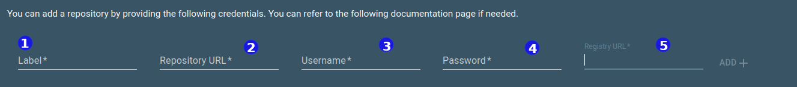
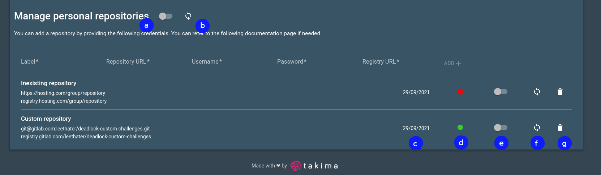

# Guide for Deadlock admins

This page explains how to add a git repository to your Deadlock instance.

## Provide your public SSH key to the maintainers

In order for Deadlock to be able to pull challenges from a private repository, its maintainer has to add your public SSH key to their list of deploy keys.

You can find your SSH key at *~/.ssh/id_rsa.pub*, if you don't have one you can generate it by running `ssh-keygen`. 

> The SSH key is necessary to show new challenges in your catalog but you will not be able to execute them if you don't provide a correct authentication token (see below).

If you are also a maintainer of the repository, take a look at the [maintainer's guide](maintainer-guide.md).

## Adding a repository

In order to add a repository to your Deadlock instance, you'll need to fill the following inputs:

- **(1)** a *Label* to distinguish it from other repositories in the list
- **(2)** *repository URL*, for example `git@gitlab.com:username/challenges.git` or `https://gitlab.com/username/challenges`
- **(3)** *username* from the registry token
- **(4)** *password* from the registry token
- **(5)** *registry URL* in following form `registry.gitlab.com.username/challenges`

___

## Managing repositories

On the managing screen, besides a creation dialog, you can see following elements: 

- **(a)** toggle the global scheduled sync that would run full synchronization once per day
- **(b)** trigger global synchronization
- **(c)** creation date of a repository
- **(d)** last synchronization status : *green* if succeeded and *red* if failed
- **(e)** toggle a scheduled once-per-day synchronisation for a specific repository
- **(f)** trigger a specific repository synchronization
- **(g)** delete a repository

> Deadlock needs to keep itself up to date with the added challenge repositories. It does so by automatic or manual *synchronization*, during which it downloads new challenges and removes no longer existent ones. 

## Troubleshooting

> Will be filled with eventual questions/answers.
