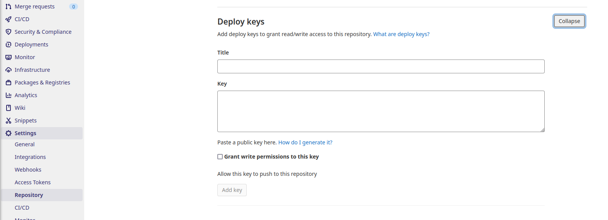
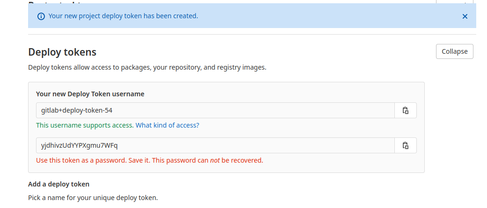

# Guide for Repository maintainers

This page explains how to install and configure your own custom Deadlock challenges repository.

## Create your *GitLab* repository

First of all, you will need a git repository to store your challenges. Deadlock currently only supports *GitLab* hosted repositories (it can be on a self-hosted or the default *gitlab.com* instance).

The repository can be public or private.

We recommend [this template](https://git.e-biz.fr/deadlock-public/deadlock-challenges-example) to start with as it comes directly with some useful scripts and a CI working out of the box (see below).

> **Important**: Deadlock pulls challenges from the **master** branch, so please make sure you have one.

## Add your challenges to your *GitLab* repository

Now you can populate the **resources** folder with your challenges. If you are not familiar with the process of creating and testing your challenges with **DCLI**, you can visit our [challenge documentation](../index.md) page.


## Build and push your challenge images to your container registry


If you used our template repository as a starting point, then you have a working out of the box `.gitlab-ci.yml` which will automatically build and push your challenges to your registry.

If you prefer doing it manually, you can do it with the following commands:

* login into your registry

```bash
# Example with gitlab.com 
docker login registry.gitlab.com -u <username> -p <token>
```


* build  and push a challenge image

```bash
# Example with gitlab.com 
cd resources/my_challenge
docker build -t registry.gitlab.com/your_group/project_name/my_challenge:version .
docker push registry.gitlab.com/your_group/project_name/my_challenge:version
```

> **Important**: *my_challenge:version* has to correspond to the mission name and version from *challenge.yml*.

You can visit this [gitlab documentation][gitlab_doc] page for more details.

## Make your repository available for a Deadlock instance

In order to your challenges become visible and runnable from a Deadlock instance, you need to add their SSH key as a deploy key and provide the Deadlock platform with an authentication *username:password* pair.

### Add the instance SSH key to your deploy keys list

For this step you will need a public SSH key of the Deadlock instance you would like to be added to. If you don't have one, ask an instance administrator to provide one.

Once you obtained the public SSH key, add it to your *GitLab* deploy keys list by going to **Settings->Repository->Deploy Keys**. You don't need to grant write permissions to this key.



### Generate deploy token

Now you need to generate a deploy token that you will provide to Deadlock.

Go to **Settings->Repository->Deploy Tokens** and generate a token with a **read_registry** permission.

Once you generated a token, you will be given a username and a password. We recommend copying the password in the first place as you will not be able to recover it after leaving that page.



This token is necessary for the Deadlock administrator to add your repository and be able to execute your challenges.

If you have access to the Deadlock manager page, then you can continue with the [admin's guide](admin-guide.md).

## Troubleshooting

> Will be filled with eventual questions/answers.

[gitlab_doc]: https://docs.gitlab.com/ee/user/packages/container_registry
